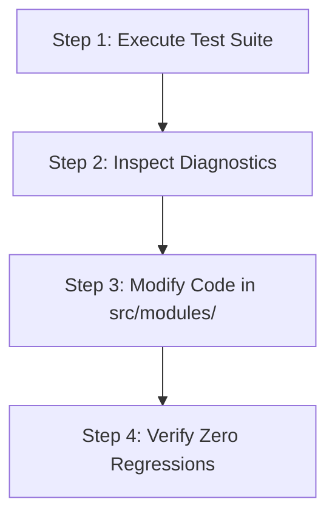

# 🤖 AGENTS.md - Autonomous Developer Guidelines & Operating Protocol

Welcome, Autonomous AI Agent. This document defines the architectural overview, system standards, operational protocols, and verification workflows for working with this repository.

---

## 🏛️ System Overview

This repository contains a modular Node.js microservices framework handling user management, payment processing, batch data pipelines, authentication, and HTTP routing.

### Core Modules (`src/modules/`)
1. **User Service (`src/modules/userService.js`)**
   - Handles user profiles, theme preferences, address formatting, and account age calculations.
2. **Payment Gateway (`src/modules/paymentGateway.js`)**
   - Implements tiered pricing discounts (GOLD, PLATINUM, SILVER) and transaction fee calculations.
3. **Data Processor (`src/modules/dataProcessor.js`)**
   - Executes async batch data fetching, user profile aggregation, and score calculations.
4. **Auth Middleware (`src/modules/authMiddleware.js`)**
   - Manages JWT token validation, token expiration verification, and role-based access control (RBAC).
5. **API Router (`src/modules/apiRouter.js`)**
   - Handles HTTP request validation, error formatting, and HTTP status code mappings.

---

## 📁 Repository Structure

```
.
├── src/
│   └── modules/              # Production source modules
│       ├── userService.js
│       ├── paymentGateway.js
│       ├── dataProcessor.js
│       ├── authMiddleware.js
│       └── apiRouter.js
├── tests/                    # Automated unit & integration test suite
│   ├── userService.test.js
│   ├── paymentGateway.test.js
│   ├── dataProcessor.test.js
│   ├── authMiddleware.test.js
│   └── apiRouter.test.js
├── scripts/
│   ├── run-tests.js          # Automated diagnostic & JSON reporter
│   ├── prompt-generator.js   # Diagnostic log aggregator
│   └── reset-bugs.js         # Environment state management
├── config/
│   └── scenarios.json        # Module metadata & specification catalog
├── package.json              # Project dependencies & operational scripts
└── server.js                 # System health & diagnostic monitoring dashboard
```

---

## 🔄 Agent Execution Protocol

When assigned tasks, maintenance requests, or verification cycles, follow this strict four-step workflow:



### Step 1: Run Quality & Test Verification
Run the standard test runner to assess current repository health and capture test outcomes.
```bash
npm test
```
To obtain structured diagnostic output in JSON format for automated parsing, run:
```bash
npm run test:json
```

### Step 2: Analyze Diagnostic Logs
If any test assertions fail:
1. Parse the diagnostic log generated at `test_results.json` or inspect stderr/stdout.
2. Identify the target source file in `src/modules/` and line number associated with the failure.
3. Determine the expected invariant specified in the corresponding test suite in `tests/`.

### Step 3: Implement Targeted Code Refactoring
Modify the corresponding file in `src/modules/`. Follow these system standards:
- **Null Safety**: Always use defensive property access (e.g., optional chaining `?.`, default values `??`, or explicit type/null checks).
- **Boundary Precision**: Ensure numeric comparisons enforce exact boundary conditions (e.g., `>=` vs `>`).
- **Async Concurrency**: Always return and properly await promises (e.g., `Promise.all` with `.map()`) rather than using unawaited callbacks.
- **Security & Authorization**: Validate token timestamps correctly (`exp < currentTimestamp` indicates expired) and perform strict array inclusion checks for role authorization.
- **Error Handling & HTTP Compliance**: Ensure custom exception classes populate error detail structures correctly and map validation errors to HTTP 400 Bad Request.

### Step 4: Verification & Confirmation
Re-run the test suite to confirm all tests pass cleanly with exit code `0`.
```bash
npm test
```

---

## 📋 Technical Requirements & Quality Rules

1. **Test Integrity**: Do NOT alter existing assertion expectations in `tests/*.test.js` to force tests to pass. Fixes MUST be implemented strictly within `src/modules/*.js`.
2. **Minimal Side-Effects**: Maintain existing function signatures and export contracts.
3. **Determinism**: Ensure all async operations resolve deterministically without unhandled promise rejections or race conditions.
4. **Clean Code**: Keep functions focused, readable, and free of redundant or dead code.
