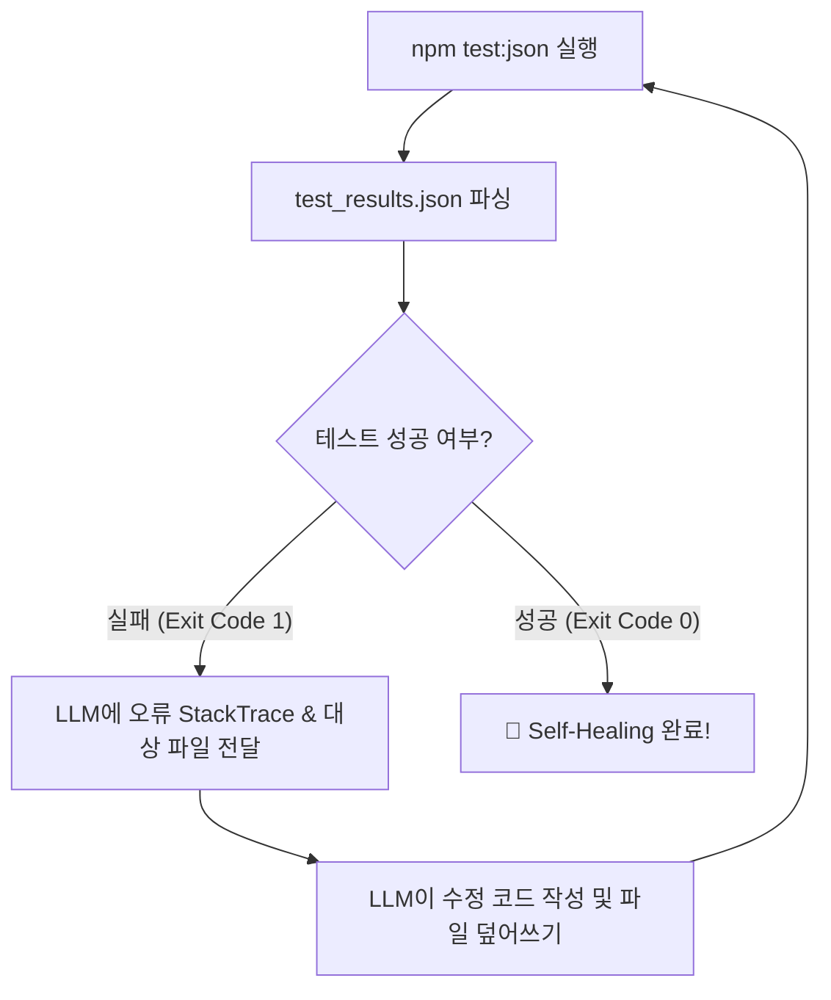

# 🛡️ LLM Self-Healing Testbed (자가 치유 AI 테스트 필드)

LLM 기반 자가 치유(Self-Healing) 시스템의 성능 측정, 자가 디버깅 프롬프트 튜닝 및 자율 에이전트 벤치마킹을 위해 제작된 테스트 필드 프로젝트입니다.

---

## 🎯 5가지 실전 오류 시나리오 (Bug Scenarios)

본 프로젝트는 실제 프로덕션 환경에서 빈번하게 발생하는 **5가지 난이도별 오류 시나리오**를 포함하고 있습니다.

| ID | 시나리오명 | 카테고리 | 난이도 | 대상 파일 | 주요 오류 증상 |
|---|---|---|---|---|---|
| **Scenario 1** | User Service | Null Safety / 속성 접근 | Easy | `src/modules/userService.js` | `TypeError: Cannot read properties of undefined` (중첩 객체 접근 오류) |
| **Scenario 2** | Payment Gateway | 경계값 & 계산 오류 | Medium | `src/modules/paymentGateway.js` | 경계값($1,000) 할인 미적용 및 배열 범위를 벗어난 인덱스 접근(`NaN` 반환) |
| **Scenario 3** | Data Processor | 비동기 흐름 (Async/Promise) | Medium | `src/modules/dataProcessor.js` | `Array.prototype.forEach` 내부 비동기 콜백 미await로 인한 빈 배열 조기 반환 |
| **Scenario 4** | Auth Middleware | 보안 및 권한 검증 로직 | Hard | `src/modules/authMiddleware.js` | 토큰 만료 조건식 반전(`exp > now`를 만료로 처리) 및 배열 검증 오류 |
| **Scenario 5** | API Router | 에러 래핑 및 응답 핸들러 | Hard | `src/modules/apiRouter.js` | 커스텀 ValidationError 수집 시 undefined 맵 접근 오류 및 500 상태 코드 잘못 할당 |

---

## 🚀 빠른 시작 (Quick Start)

### 1. 테스트 실행 (Fail 상태 확인)
Node.js 내장 테스트 러너(`node --test`)를 통해 5개 모듈의 오류를 확인합니다.
```bash
npm test
```

### 2. 진단 JSON 및 LLM 프롬프트 생성
스택 트레이스와 실패 로그를 파싱하여 `test_results.json` 및 `llm_prompt_sample.txt`를 자동 생성합니다.
```bash
npm run test:json
npm run prompt
```

### 3. 상태 리셋 명령
- **오류 상태로 초기화 (Self-Healing 테스트 준비)**:
  ```bash
  npm run reset
  ```
- **완전 정답(Fixed) 상태로 리셋**:
  ```bash
  npm run reset:clean
  ```

---

## 🌐 대시보드 모니터링 웹 콘솔

시각적으로 자가 치유 진행 상태와 모듈별 테스트 결과를 확인하고 프롬프트를 복사할 수 있는 웹 대시보드를 제공합니다.

```bash
npm start
```
- 접속 주소: **`http://localhost:3000`**
- 주요 기능:
  - 📊 모듈별 Pass / Fail 실시간 뱃지 표기
  - 🐞 원클릭 버그 재주입 (Reset to Buggy)
  - ✨ 원클릭 정답 복원 (Restore Clean)
  - 📋 LLM 자동 디버깅 프롬프트 1초 복사

---

## 🤖 LLM Self-Healing 에이전트 연동 가이드

자가 치유 시스템(LLM Agent / Script)을 구축할 때 다음 루프(Loop)를 적용하세요:



### 자가 치유 시스템 구현 예시 (Python / Node.js Pseudo Code)
```javascript
import { execSync } from 'child_process';
import fs from 'fs';

function runSelfHealingLoop() {
  for (let i = 0; i < 5; i++) {
    try {
      execSync('npm test');
      console.log('✅ 모든 테스트 통과! 시스템 치유 완료.');
      break;
    } catch (error) {
      console.log(`❌ 테스트 실패 (시도 ${i + 1}/5). LLM으로 디버깅 진행...`);
      
      // 1. 진단 JSON 읽기
      execSync('npm run test:json');
      const diagnostics = JSON.parse(fs.readFileSync('test_results.json', 'utf8'));

      // 2. LLM 호출하여 코드 수정 요청
      // const fixedCode = await callLLM(diagnostics);
      // fs.writeFileSync('src/modules/userService.js', fixedCode);
    }
  }
}
```

---

## 📁 프로젝트 구조

```
test-field/
├── README.md                 # 본 문서
├── package.json              # npm 스크립트 정의
├── server.js                 # 실시간 모니터링 웹 대시보드 서버 (포트 3000)
├── config/
│   └── scenarios.json        # 버그 시나리오 메타데이터
├── src/
│   ├── modules/              # 현재 소스 코드 (Self-Healing 대상)
│   │   ├── userService.js
│   │   ├── paymentGateway.js
│   │   ├── dataProcessor.js
│   │   ├── authMiddleware.js
│   │   └── apiRouter.js
│   └── backups/              # 백업본 (.buggy.js / .clean.js)
├── tests/                    # Unit & Integration 테스트 스위트
│   ├── userService.test.js
│   ├── paymentGateway.test.js
│   ├── dataProcessor.test.js
│   ├── authMiddleware.test.js
│   └── apiRouter.test.js
└── scripts/
    ├── run-tests.js          # TAP/JSON 리포터 실행 스크립트
    ├── reset-bugs.js         # 오류 상태 복원/초기화 스크립트
    └── prompt-generator.js   # LLM 자가 치유 프롬프트 생성기
```
